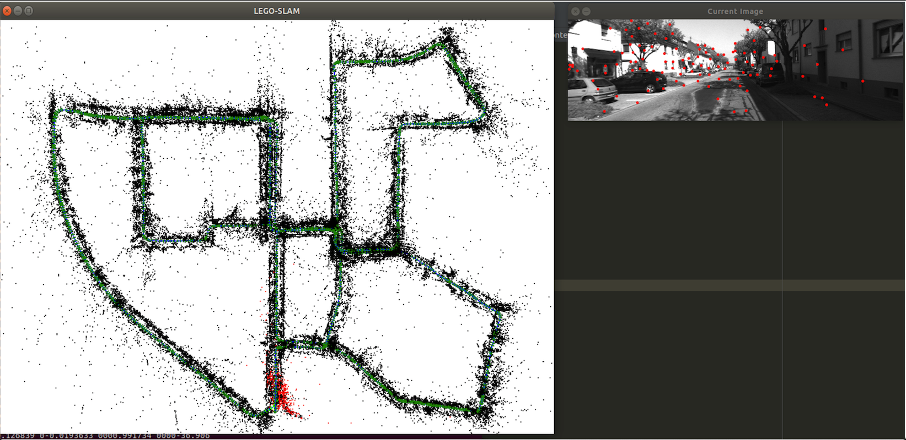
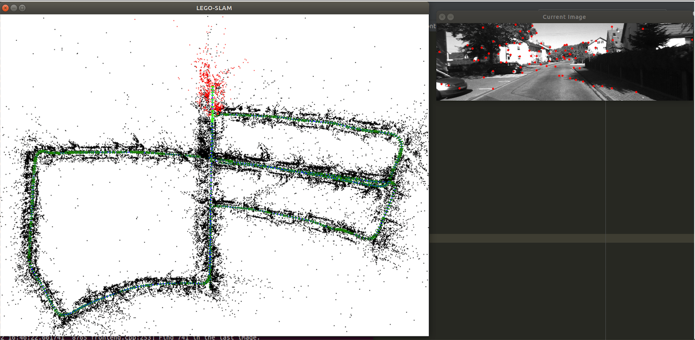

# LEGO-SLAM #

**LEGO-SLAM** is a light weight stereo visual SLAM system which contains multi *hand-made* modules, such as a frontend with the pyramid LK optical flow method based on the Gauss-Newton algorithm & OpenCV ParallelLoopBody and a backend with the graph-based Levenberg-Marquardt optimization algorithm ([**LEGO**](https://github.com/zha0ming1e/LEGO) or [**g2o**](https://github.com/RainerKuemmerle/g2o) (optional)). Generally speaking, LEGO-SLAM is a silding-window stereo visual SLAM framework for learning and practicing visual SLAM theories. Now, the optimization algorithm in the backend ([LEGO](https://github.com/zha0ming1e/LEGO)) only depends on the Levenberg-Marquardt algorithm and it will include more algorithms in the future, such as Dog-leg. Moreover, the loop-closure module will be implemented in the near future. This version is only tested on Ubuntu 18.04.


## Installation ##

### Prerequisites

- **GCC** and [**CMake**](https://cmake.org/) 

- [**Eigen3**](http://eigen.tuxfamily.org/): Linear algebra  

  On Ubuntu 18.04, we can install CMake and Eigen3 following: 

  ```bash
  # gcc and cmake 
  sudo apt-get install gcc cmake 
  # Eigen3 
  sudo apt-get install libeigen3-dev 
  ```
  
- [**OpenCV 3**](https://opencv.org/): Only for image visualization and I/O (Version >= 3.2)  

- [**Sophus**](https://github.com/strasdat/Sophus): Lie groups and Lie algebra based on Eigen 

- [**Pangolin**](https://github.com/stevenlovegrove/Pangolin): Display and interactive visualization based on OpenGL 

- [**glog**](https://github.com/google/glog), [**gtest**](https://github.com/google/googletest), [**gflags**](https://github.com/gflags/gflags) 

- [**CSparse**](https://people.engr.tamu.edu/davis/suitesparse.html): Sparse matrix computing 

  ```bash
  # suitesparse 
  sudo apt-get install libsuitesparse-dev
  ```

- [**g2o**](https://github.com/RainerKuemmerle/g2o) (optional): A general framework for graph optimization 

- [**LEGO**](https://github.com/zha0ming1e/LEGO): A light weight graph-based optimization library 

### Build and Run

- **Build** 

  We can build and run LEGO-SLAM from this [repository](https://github.com/zha0ming1e/LEGO-SLAM.git) and follow: 

  ```bash
  git clone https://github.com/zha0ming1e/LEGO-SLAM.git 
  cd LEGO-SLAM/ 
  mkdir build/ 
  cd build/ 
  cmake .. && make -j6 
  ```

  Now we have already built the LEGO-SLAM and then we can test and run it.

- **Test and Run**: There will be 2 executable files under the **bin/** folder 

  - **Test**: Test triangulation in 3D  

    ```bash
    # test triangulation 
    ./bin/legoslam_test_triangulation 
    
    [==========] Running 1 test from 1 test case.
    [----------] Global test environment set-up.
    [----------] 1 test from LEGOSLAMTest
    [ RUN      ] LEGOSLAMTest.Triangulation
    [       OK ] LEGOSLAMTest.Triangulation (0 ms)
    [----------] 1 test from LEGOSLAMTest (0 ms total)
    
    [----------] Global test environment tear-down
    [==========] 1 test from 1 test case ran. (1 ms total)
    [  PASSED  ] 1 test.
    ```

  - **Run**: Modify the config files under the [config/](./config/) folder, such as the path of [**KITTI**](http://www.cvlibs.net/datasets/kitti/eval_odometry.php) datasets and then run LEGO-SLAM 

    ```bash
    # KITTI 00 
    ./bin/legoslam_kitti_feature ./config/kitti_00.yaml 
    # KITTI 05 
    ./bin/legoslam_kitti_feature ./config/kitti_05.yaml
    ```

### Results 

This version only supports [**KITTI odometry datasets**](http://www.cvlibs.net/datasets/kitti/eval_odometry.php). 

- **KITTI 00** 

   

- **KITTI 05** 

   

- **Demo** 

   


## References ##

- [**ORB-SLAM2**](https://github.com/raulmur/ORB_SLAM2): Real-Time SLAM for Monocular, Stereo and RGB-D Cameras, with Loop Detection and Relocalization Capabilities 
- [**ORB-SLAM3**](https://github.com/UZ-SLAMLab/ORB_SLAM3): An Accurate Open-Source Library for Visual, Visual-Inertial and Multi-Map SLAM 
- [**DSO**](https://github.com/JakobEngel/dso): Direct Sparse Odometry 
- [**LDSO**](https://github.com/tum-vision/LDSO): DSO with SIM(3) pose graph optimization and loop closure 
- [**VINS-Mono**](https://github.com/HKUST-Aerial-Robotics/VINS-Mono): A Robust and Versatile Monocular Visual-Inertial State Estimator 
- [**VINS-Course**](https://github.com/HeYijia/VINS-Course): VINS-Mono code without Ceres or ROS 
- [**slambook2**](https://github.com/gaoxiang12/slambook2): Edition 2 of the slambook 

